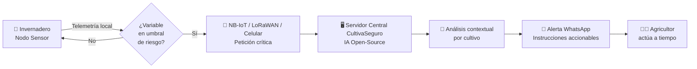

<div align="center">

# 🌱 CultivaSeguro

### *Escudo tecnológico contra los extremos climáticos para la Agricultura Familiar Campesina*

> **"Democratizar la asesoría experta para proteger el sustento de quienes cultivan nuestros alimentos."**

[](https://www.duoc.cl/innovasostenible-2026/)
[](https://www.duoc.cl/innovasostenible-2026/)
[](#)
[](https://www.duoc.cl)

</div>

---

## 📑 Tabla de Contenidos

- [📖 Sobre el Proyecto](#-sobre-el-proyecto)
- [🌍 El Problema](#-el-problema)
- [💡 La Solución](#-la-solución)
- [⚙️ Cómo Funciona](#️-cómo-funciona)
- [🏗️ Arquitectura Técnica](#️-arquitectura-técnica)
- [🚀 Diferencial e Innovación](#-diferencial-e-innovación)
- [🌱 Impacto en Sostenibilidad](#-impacto-en-sostenibilidad)
- [🏆 Alineación con el Torneo Innova Sostenible 2026](#-alineación-con-el-torneo-innova-sostenible-2026)
- [👥 Equipo y Motivación](#-equipo-y-motivación)
- [🗺️ Roadmap del Torneo](#️-roadmap-del-torneo)
- [📚 Fuentes que Respaldan el Proyecto](#-fuentes-que-respaldan-el-proyecto)
- [📄 Licencia y Aviso](#-licencia-y-aviso)

---

## 📖 Sobre el Proyecto

**CultivaSeguro** es una solución tecnológica integral diseñada para mitigar las severas pérdidas económicas que sufren los pequeños agricultores frente a los embates extremos del cambio climático, como **heladas atípicas**, **estrés hídrico agudo** y **olas de calor**.

El sistema despliega una red de **nodos físicos de bajo costo dentro de los invernaderos**, que combinan sensores microclimáticos, **conectividad inalámbrica adaptada a cada zona (NB-IoT, LoRaWAN o red celular)** y energía solar autónoma. Las peticiones críticas son procesadas por un **motor de IA open-source que opera en el servidor centralizado de CultivaSeguro**, y la respuesta llega al agricultor como alerta preventiva accionable en lenguaje natural —vía WhatsApp— justo antes de que ocurra una catástrofe.

> 🎯 **Propósito**: Migrar el paradigma de la **indemnización post-desastre** (modelo actual del Estado vía seguro PACSA) hacia la **mitigación activa pre-evento**.

---

## 🌍 El Problema

La matriz silvoagropecuaria chilena enfrenta un punto de inflexión estructural. La **Agricultura Familiar Campesina (AFC)** —que agrupa más de **128.560 explotaciones a nivel nacional**— es el segmento más vulnerable y, paradójicamente, el menos atendido por la oferta AgTech tradicional.

### 📊 Cifras que dimensionan la urgencia

| 🌡️ Indicador | 📈 Magnitud | 🔗 Fuente |
|---|---|---|
| Pérdidas proyectadas del sector silvoagropecuario al 2050 | **> US$ 1.000 millones** | Plan Sectorial de Adaptación al Cambio Climático — MMA / ODEPA (2024) |
| Heladas julio 2024 (Coquimbo → Biobío) | **2.000 pequeños agricultores afectados / US$ 200 millones en pérdidas** | INIA Intihuasi vía Diario Frutícola |
| Inundaciones invierno 2023 (zona centro-sur) | **6.338 productores AFC dañados / US$ 900 millones** | INDAP / Colliers |
| Reducción de productividad por eventos climáticos | **Hasta 9% / $3,9 millones CLP por hectárea/año** | *Pérdidas y Desperdicios de Alimentos en Chile* — U. de Chile / ODEPA (2023) |
| Diferencia térmica nocturna interior/exterior del invernadero plástico | **Sólo +1 °C** | INIA La Platina (Chacón, 2024) |
| Aceleración del calentamiento (últimos 33 años) | **+0,21 °C/década** | Reporte Anual del Clima en Chile 2024 — DMC |

> ⚠️ **Hallazgo crítico (INIA La Platina, 2024):** El invernadero plástico del pequeño agricultor **no lo protege de la helada radiativa nocturna**. Esto justifica empíricamente la necesidad de una **alerta temprana in-situ**, no macroclimática.

### 👴 El usuario real: un agricultor adulto mayor con baja alfabetización digital

El diseño de cualquier solución AgTech para la AFC debe partir de un hecho demográfico verificado: el sector está **estructuralmente envejecido**, con tasa de reemplazo generacional negativa.

| 👤 Segmento etario de productores AFC | 📊 Porcentaje | 🔗 Fuente |
|---|---|---|
| Productores mayores de 65 años | **34,3%** | ODEPA / INE — CAF 2021 |
| Productores entre 50 y 64 años | **39,9%** | ODEPA / INE — CAF 2021 |
| **Total productores con 50+ años** | **74,2%** | Cálculo basado en CAF 2021 |
| Edad promedio del agricultor familiar | **> 58 años** (vs. 51–53 en 2007) | U. de Chile / ODEPA |
| Adultos mayores rurales que requieren ayuda para trámites digitales | **76%** | CASEN 2022 |
| Adultos mayores que ya usan WhatsApp a diario | **59%** | Observatorio del Envejecimiento UC-Confuturo (2022) |

> 📌 **Implicancia de diseño:** un agricultor promedio en la AFC tiene sobre 58 años, baja alfabetización digital y ya usa WhatsApp todos los días. Esto **descarta** las apps nativas complejas como canal de adopción y **valida** la estrategia de notificación conversacional vía WhatsApp como el único canal con cobertura efectiva en el segmento.

### 🧨 La falla lógica del modelo actual

El Estado subsidia hasta el **95% de la prima del seguro agrícola (PACSA)**, pero ese mecanismo es **estructuralmente reactivo**: compensa el capital perdido, pero no previene la destrucción de la cosecha ni resguarda la cadena comercial del pequeño productor.

```diff
- Modelo actual: Pérdida → Catastro → Indemnización (semanas/meses)
+ CultivaSeguro: Sensor → IA → Alerta accionable (minutos)
```

---

## 💡 La Solución

CultivaSeguro instala dentro del invernadero pequeños **nodos sensores autónomos** que monitorean en tiempo real las variables críticas del microclima, y disparan una alerta preventiva **personalizada al cultivo** sólo cuando una variable se acerca al umbral de riesgo.

### 🧩 Componentes clave

<table>
<tr>
<td width="50%" valign="top">

**🔌 Nodo Físico (Hardware en invernadero)**
- 📡 Microcontrolador con conectividad inalámbrica (NB-IoT, LoRaWAN o red celular según zona)
- 🌡️ Sensor de temperatura y humedad
- 🔆 Sensor de iluminancia (lux reales)
- 🧭 Sensor de presión barométrica
- ☀️ Panel solar + batería = autonomía energética total
- 🛠️ Diseño optimizado para **fabricación digital**

</td>
<td width="50%" valign="top">

**☁️ Plataforma Central (Servidor + IA)**
- 🤖 Motor de IA **open-source en servidor propio de CultivaSeguro** (no en el nodo)
- 🖥️ Dashboard web diurno, limpio y legible bajo el sol
- ⚙️ Configuración por tipo de hortaliza (umbrales personalizados)
- 📲 Notificaciones vía **WhatsApp Business API**
- 🔒 Privacidad por diseño (Ley 21.719)

</td>
</tr>
</table>

---

## ⚙️ Cómo Funciona



### 🔄 Lógica Event-Driven (la disrupción arquitectónica)

> En lugar de transmitir telemetría continua —lo que disparía costos de datos y batería— el nodo **evalúa los datos localmente** y **sólo despierta la red cuando detecta un riesgo real**.

| Modelo tradicional IoT | 🆚 | CultivaSeguro (Event-Driven) |
|---|---|---|
| Telemetría continua → Cloud | | Evaluación on-device + envío sólo en evento |
| Plan de datos alto / batería corta | | Plan IoT mínimo / batería >10 años (NB-IoT PSM) |
| API pagada por solicitud | | IA open-source en servidor propio (OPEX ≈ 0 por consulta) |
| Dashboard complejo | | Mensaje WhatsApp en lenguaje natural |

---

## 🏗️ Arquitectura Técnica

### 🔧 Stack Tecnológico

| Capa | Tecnología | Justificación técnica |
|---|---|---|
| **Hardware** | Microcontrolador + módulo de conectividad (ej. Quectel BC66, SIMCom SIM7000G, módulos LoRa) | Costo unitario US$ 5–10, *link budget* alto (penetra invernaderos densos) |
| **Sensores** | Temperatura, humedad, presión, iluminancia | Resolución microclimática *in situ* |
| **Conectividad** | **NB-IoT / LoRaWAN / Red Celular** — protocolo adaptado según cobertura y requerimientos del predio | Red NB-IoT comercial de Entel/Wisely (2023) cubre Arica→Punta Arenas; LoRaWAN para zonas sin cobertura celular |
| **Energía** | Panel solar + almacenamiento Li-ion | Autonomía indefinida bajo PSM/eDRX |
| **Backend IA** | LLM open-source (Llama 3.1 / Qwen 2.5) en **servidor centralizado de CultivaSeguro** | Un único servidor propio atiende a todos los clientes. **Elimina dependencia de APIs pagas por solicitud**, garantizando viabilidad financiera del modelo SaaS rural. |
| **Notificación** | WhatsApp Business API (plantillas categoría *Utility*) | Canal masivo, sin instalar app, opt-in según Ley 21.719 |
| **Frontend** | Dashboard web responsive con diseño diurno | Legibilidad bajo luz solar directa |

> ⚙️ **Nota arquitectónica:** La IA reside exclusivamente en el **servidor central de CultivaSeguro**, no en el nodo del agricultor. El nodo IoT es un dispositivo de bajo costo (MCU + sensores + módulo de conectividad) que solo transmite una señal cuando detecta una anomalía. El procesamiento inteligente ocurre una única vez en la infraestructura propia del servicio, amortizando el costo entre todos los clientes.

### 📐 Diagrama de despliegue

```
┌─────────────────────────────────────────────────────────────────┐
│                    🌾 PREDIO DEL AGRICULTOR                     │
│                                                                  │
│   ┌──────────────────┐         ┌──────────────────┐              │
│   │  Invernadero #1  │         │  Invernadero #2  │              │
│   │  [☀️ Nodo IoT]  │         │  [☀️ Nodo IoT]   │              │
│   └────────┬─────────┘         └────────┬─────────┘              │
│            │                            │                        │
└────────────┼────────────────────────────┼────────────────────────┘
             │  📡 NB-IoT / LoRaWAN /     │
             │      Celular (sólo eventos)│
             ▼                            ▼
       ┌─────────────────────────────────────────┐
       │   ☁️ Servidor Central CultivaSeguro     │
       │  ┌───────────────────────────────────┐  │
       │  │  🤖 Motor IA (open-source)        │  │
       │  │  🧠 Contexto agronómico cultivo   │  │
       │  │  📝 Generación de recomendación   │  │
       │  └───────────────────────────────────┘  │
       └───────────────────┬─────────────────────┘
                           │
                           ▼
                  ┌─────────────────┐
                  │ 📲 WhatsApp API │
                  └────────┬────────┘
                           │
                           ▼
                  👨‍🌾  Agricultor recibe alerta
                       en lenguaje natural
```

---

## 🚀 Diferencial e Innovación

### 🆚 Benchmark competitivo

| Atributo | **CultivaSeguro** | Red Agromet (INIA) | CropX / Wiseconn | Davis Instruments |
|---|---|---|---|---|
| **Segmento** | AFC (pequeño agricultor) | Público general | Agroindustria | Académico/Corporativo |
| **Costo usuario** | 🟢 Ultra-bajo (subsidiable INDAP) | 🟢 Gratuito | 🔴 > US$ 500/nodo | 🟡 US$ 450–800 |
| **Resolución** | 🟢 Microclimática *in situ* | 🔴 Macro (comunal) | 🟢 Microclimática | 🟢 Microclimática |
| **Notificación** | 🟢 Push WhatsApp proactivo | 🔴 Web pasiva | 🟡 App/email | 🔴 Consola local |
| **Carga cognitiva** | 🟢 Muy baja (conversacional, diseñada para agricultor adulto mayor: 74,2% del segmento >50 años) | 🟡 Media | 🔴 Alta (dashboards) | 🔴 Media-Alta |
| **IA** | 🟢 Open-source en servidor propio | 🔴 No | 🟡 Cloud predictiva (API paga) | 🔴 No |

### 🌊 Océano azul detectado

> Nicho de **"monitoreo microclimático de ultra-bajo costo con interfaz conversacional"** para AFC. El sistema oficial **Agromet/heladas.minagri.gob.cl** opera a escala regional y **no compite, sino complementa** la capa fina *last-mile* que ofrece CultivaSeguro.

### 🔥 Tres palancas disruptivas

1. **Conectividad rural viable y barata en Chile** — NB-IoT comercial (Entel/Wisely, 2023) complementado con LoRaWAN y red celular según zona. Cobertura efectiva desde Arica hasta Punta Arenas.
2. **LLM open-source en servidor propio de CultivaSeguro** — Un único servidor centralizado atiende a todos los clientes, eliminando el costo por consulta de APIs externas y garantizando viabilidad financiera del modelo SaaS rural.
3. **WhatsApp Business API** — El 59% de los agricultores mayores ya usa WhatsApp a diario (Observatorio UC-Confuturo, 2022). No hay app que instalar ni hábito que crear: solo recibir el mensaje.

---

## 🌱 Impacto en Sostenibilidad

### 💧 Eje hídrico
- Cada kilogramo de tomate perdido implica el desperdicio de **~200 L de agua virtual** (Water Footprint Network).
- Una hectárea de tomate de invernadero protegida = **~20 millones de litros/ha** salvados por cosecha.

### 🌍 Eje climático
- Factor FAO: **2,5 kg CO₂eq por cada kg de alimento perdido** (incluye producción, transporte y descomposición).
- 100 ha protegidas a escala piloto regional ≈ **25.000 toneladas de CO₂eq evitadas**.
- Las Pérdidas y Desperdicios de Alimentos (PDA) representan **8–10% de las emisiones globales de GEI** (ONU/PNUMA 2024).

### 👨‍🌾 Eje social
- Protección del sustento económico de la AFC (sector más vulnerable).
- Democratización del acceso a asesoría experta.
- Reducción de la brecha digital rural, con interfaz pensada para el adulto mayor.

### 🇨🇱 Alineación país
- ✅ **Plan Sectorial de Adaptación al Cambio Climático Silvoagropecuario 2024–2028** (MMA / ODEPA).
- ✅ **Estrategia Nacional de Residuos Orgánicos Chile 2040** (MMA).
- ✅ **Estrategia INDAP 2023–2030** (envejecimiento estructural de la AFC como problemática prioritaria).
- ✅ **ODS 2** (Hambre Cero), **ODS 6** (Agua Limpia), **ODS 12** (Producción Responsable), **ODS 13** (Acción por el Clima).

---

## 🏆 Alineación con el Torneo Innova Sostenible 2026

> *"¿Cómo podemos crear soluciones que ayuden a las personas y comunidades a enfrentar mejor los efectos del cambio climático y cuidar su entorno?"*

### 🎯 Línea de acción seleccionada

> **🌾 f) Bienestar, salud y comunidades más resilientes**
>
> *"Explorar alternativas que permitan fortalecer el bienestar de comunidades en cuanto a educación, salud, etc. promoviendo prácticas que incentiven e impulsen el desarrollo sostenible en diversos territorios..."*
>
> **Ámbitos cubiertos por CultivaSeguro:** Comunidades rurales · Alimentación y Agricultura sostenible · Impacto territorial · Educación ambiental y climática.

### 📋 Cumplimiento de los criterios de evaluación

| Criterio (Etapa 1: Activación) | Ponderación | Cómo lo cumple CultivaSeguro |
|---|---|---|
| **Problema alineado al desafío** | 20% | Pérdidas climáticas cuantificadas con fuentes oficiales (MMA, ODEPA, DMC, INIA, INDAP). |
| **Coherencia idea/proyecto** | 30% | Solución integrada (hardware + IA centralizada + WhatsApp) con cadena causal explícita y diseño centrado en el agricultor adulto mayor (CAF 2021). |
| **Potencial de la solución** | 30% | Benchmark competitivo, ventaja en océano azul AFC, tres palancas disruptivas verificadas. |
| **Formulación de la propuesta** | 5% | Documento estructurado, respaldado por más de 40 fuentes formales. |
| **Equipo** | 15% | Ing. en Conectividad y Redes — vinculación directa con NB-IoT/LoRaWAN, Python y sensores, además de raíz territorial en Melipilla. |

### 🏅 Premio Especial HUB Providencia (Fabricación Digital)

CultivaSeguro califica como candidato natural a la **Mención Honrosa HUB Providencia**: el nodo físico está diseñado con enfoque de **prototipado experimental** (impresión 3D, corte láser, optimización de PCB) y **iteración con fabricación digital** —exactamente el perfil que el premio busca reconocer.

---

## 👥 Equipo y Motivación

> *"La tecnología y las telecomunicaciones tienen que servir para proteger a quienes más lo necesitan."*

Como estudiantes de **Ing. en Conectividad y Redes** de Duoc UC, contamos con las competencias específicas que este proyecto requiere para no quedarse en el papel:

### 🛠️ Capacidades técnicas internas

- ✅ Experiencia armando **redes de datos y proyectos de monitoreo**.
- ✅ **Programación en Python** para captura de datos de sensores ambientales.
- ✅ Transmisión en tiempo real a infraestructura *cloud*.
- ✅ Optimización de protocolos para conectividad de bajo consumo.

### 💚 Lo que nos mueve

Vivimos en **Melipilla, una comunidad de microagricultores**, lo que nos permite resolver problemas concretos de conectividad rural, no solo imaginarlos. Queremos convertir nuestro conocimiento técnico en una **herramienta real que ataque un problema país**: la desprotección del pequeño agricultor frente al cambio climático. Estamos convencidos de que la mejor tecnología **no tiene por qué ser cara ni complicada** —tiene que llegar a las manos correctas, en el momento correcto, con el mensaje correcto.

---

## 🗺️ Roadmap del Torneo

```
2026
├── 🟢 08 ABR – 06 MAY ─ Postulación (Activación) ◄── ETAPA ACTUAL
├── ⚪ 11 MAY – 20 MAY ─ Formación específica
├── ⚪ 02 JUN – 03 JUL ─ Aceleración
├── ⚪ 04 JUL – 19 JUL ─ Demo Day Final
└── ⚪    20 AGO       ─ Premiación
```

### 🎯 Roadmap post-torneo (visión de escalamiento)

| Año | Fondo objetivo | Monto | Hito |
|---|---|---|---|
| **2026** | Corfo Semilla Inicia | hasta $15–17M CLP | Validación técnica + MVP |
| **2027** | FIA Interés Privado | hasta $120M CLP | Piloto 30–50 invernaderos |
| **2027–2028** | Corfo Expande / INDAP IFP-PRI | hasta $25M CLP | Primeras ventas + subsidio compra |
| **2028+** | BID Lab / GSMA Innovation Fund | Internacional | Escalamiento LATAM |

---

## 📚 Fuentes que Respaldan el Proyecto

### 🇨🇱 Marco institucional chileno

- **MMA / ODEPA** — *Plan Sectorial de Adaptación al Cambio Climático del Sector Silvoagropecuario 2024–2028*. [expedientes.mma.gob.cl](https://expedientes.mma.gob.cl)
- **DMC** — *Reporte Anual de la Evolución del Clima en Chile 2024*. [climatologia.meteochile.gob.cl](https://climatologia.meteochile.gob.cl/publicaciones/reporteEvolucionClima/reporteEvolucionClima2024.pdf)
- **INIA La Platina** — Chacón, G. (2024) *Hortalizas versus heladas*. [inia.cl](https://www.inia.cl/2024/06/25/hortalizas-versus-heladas/)
- **U. de Chile / ODEPA** (2023) — *Pérdidas y desperdicios de alimentos en Chile*.
- **ODEPA / INE** — *VIII Censo Agropecuario y Forestal 2021 (CAF 2021)*. [odepa.gob.cl](https://www.odepa.gob.cl/contenidos-rubro/estadisticas/estadisticas-productivas/resultados-del-viii-censo-agropecuario-y-forestal) · [ine.gob.cl](https://www.ine.gob.cl/censoagropecuario)
- **INDAP** — *Estrategia 2023–2030* y Programas PRA, PRI e IFP. [indap.gob.cl](https://www.indap.gob.cl)
- **MMA** — *Estrategia Nacional de Residuos Orgánicos Chile 2040 (ENRO)*.

### 👨‍🌾 Demografía y brecha digital agrícola

- **ODEPA / INE** (2022) — *Análisis de Resultados del VIII Censo Agropecuario y Forestal*: distribución etaria de productores AFC (34,3% > 65 años; 74,2% > 50 años).
- **INDAP** (2023) — *Estrategia Institucional 2023–2030*: envejecimiento estructural de la AFC como problemática prioritaria.
- **Observatorio del Envejecimiento UC-Confuturo** (2022) — *Uso de TIC en adultos mayores en Chile*: 59% usa WhatsApp, 76% requiere asistencia para trámites digitales. [observatorioenvejecimiento.uc.cl](https://observatorioenvejecimiento.uc.cl/wp-content/uploads/2022/06/Observatorio-Reporte-TICS.pdf)
- **CASEN 2022** — Acceso a internet en hogares rurales con adultos mayores (76% zona rural). [ministeriodesarrollosocial.gob.cl](https://www.ministeriodesarrollosocial.gob.cl)
- **FAO / CEPAL / IICA** — *Perspectivas de la Agricultura y el Desarrollo Rural en las Américas 2023–2024*: informalidad laboral agrícola 86%, envejecimiento regional de la AFC. [repositorio.cepal.org](https://repositorio.cepal.org/server/api/core/bitstreams/ec3e9a9f-593e-4c55-85a3-b5eefbeca839/content)

### 📡 Habilitadores tecnológicos

- **Entel / Wisely** — *NB-IoT en Chile: cómo la red de Entel habilita el IoT masivo*. [marketing.wisely.cl](https://marketing.wisely.cl/blog/nbiot-chile-red-entel-iot-masivo)
- **SUBTEL** — Homologación de equipos terminales. [subtel.gob.cl](https://www.subtel.gob.cl)
- **arXiv / IEEE Xplore** — Benchmarks de inferencia LLM en hardware de bajo costo (SBC con NPU, Llama 3.1 / Qwen 2.5). [arxiv.org/html/2511.07425v1](https://arxiv.org/html/2511.07425v1)
- **Meta** — WhatsApp Business Platform API (plantillas categoría *Utility*).

### 🌎 Sostenibilidad y referencia internacional

- **FAO** (2013) — *Food Wastage Footprint: Impacts on Natural Resources*.
- **ONU / PNUMA** (2024) — *Food Waste Index Report*.
- **Water Footprint Network** — Aldaya & Hoekstra, *The Water Footprint of Food*. [waterfootprint.org](https://waterfootprint.org)
- **HuellaChile** (MMA) — [huellachile.cl](https://huellachile.cl)
- **IPCC** — Paneles climáticos vigentes.

### ⚖️ Marco regulatorio

- **Ley 21.719** — Protección de datos personales (Chile, vigencia diciembre 2026). [bcn.cl](https://www.bcn.cl/leychile/navegar?idNorma=1209272)
- **Ley 18.168** — Ley General de Telecomunicaciones.

---

## 📄 Licencia y Aviso

Este proyecto se desarrolla en el marco del **Torneo Innova Sostenible 2026 — Duoc UC**, con el apoyo de **Banco Santander** y la colaboración del **HUB Providencia**. El presente repositorio constituye documentación de la etapa de **ideación / activación**.

> Toda referencia a fuentes terceras es de carácter académico y de respaldo. Los datos cuantitativos están citados según sus fuentes originales; cualquier extrapolación (e.g., estimaciones de litros de agua o toneladas de CO₂ evitadas) está marcada como estimación metodológica con la fórmula utilizada.

---

<div align="center">

### 🌱 *"Creando hoy las ideas del mañana"* 🌱

**CultivaSeguro · 2026 · Duoc UC**

[](https://www.duoc.cl/innovasostenible-2026/)

</div>
